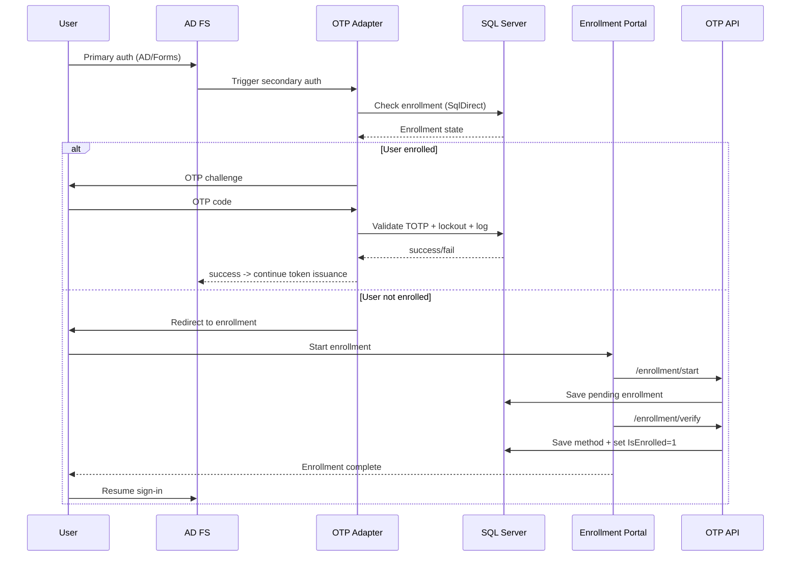
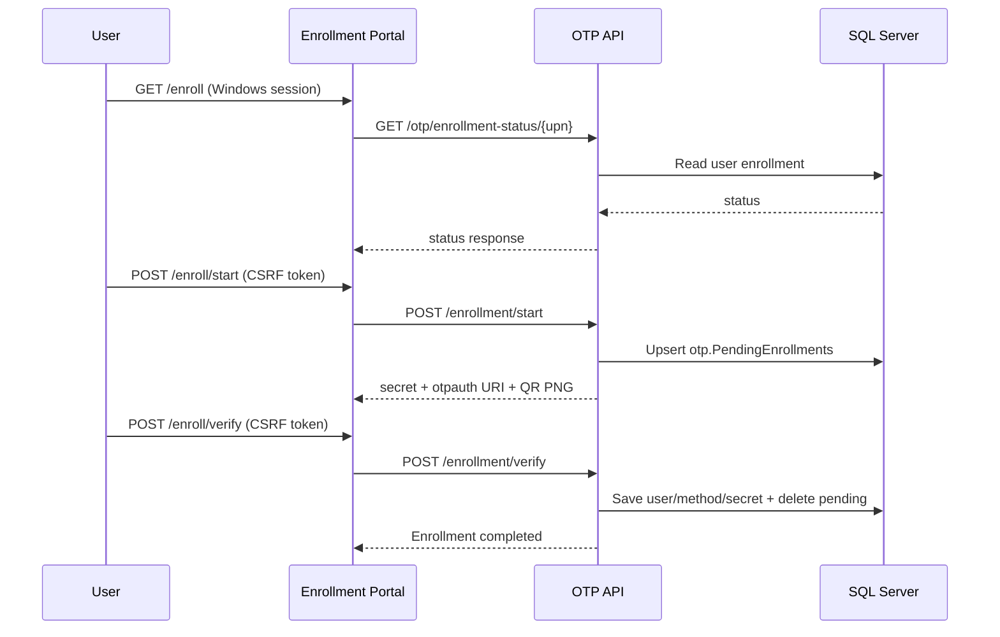
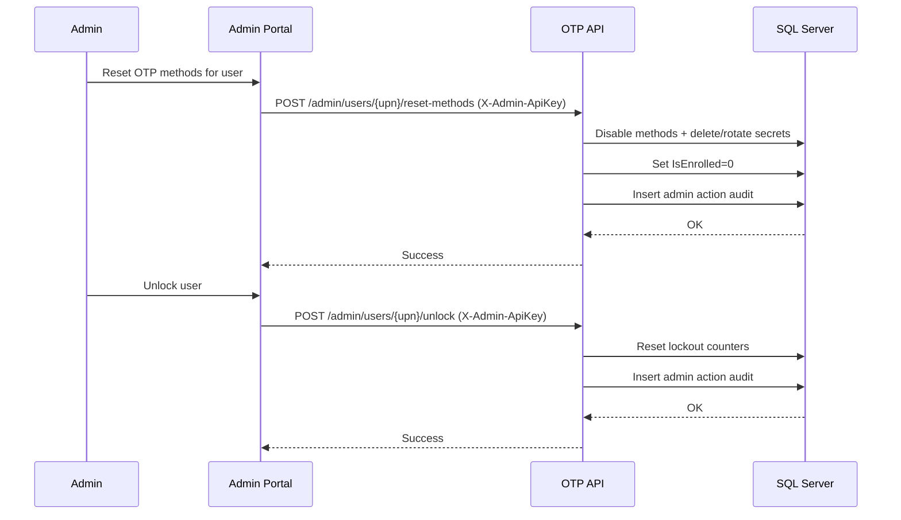

# Flux

## Sequence - Secondary OTP (AD FS, mode SqlDirect)

```mermaid
sequenceDiagram
    participant U as User
    participant ADFS as AD FS
    participant ADP as OTP Adapter
    participant SQL as SQL Server
    participant ENR as Enrollment Portal
    participant API as OTP API

    U->>ADFS: Primary auth (AD/Forms)
    ADFS->>ADP: Trigger secondary auth
    ADP->>SQL: Check enrollment (SqlDirect)
    SQL-->>ADP: Enrollment state

    alt User enrolled
        ADP->>U: OTP challenge
        U->>ADP: OTP code
        ADP->>SQL: Validate TOTP + lockout + log
        SQL-->>ADP: success/fail
        ADP-->>ADFS: success -> continue token issuance
    else User not enrolled
        ADP->>U: Redirect to enrollment
        U->>ENR: Start enrollment
        ENR->>API: /enrollment/start
        API->>SQL: Save pending enrollment
        ENR->>API: /enrollment/verify
        API->>SQL: Save method + set IsEnrolled=1
        ENR-->>U: Enrollment complete
        U->>ADFS: Resume sign-in
    end
```

## Sequence - Enrollment portal (Windows auth + CSRF)

```mermaid
sequenceDiagram
    participant U as User
    participant ENR as Enrollment Portal
    participant API as OTP API
    participant SQL as SQL Server

    U->>ENR: GET /enroll (Windows session)
    ENR->>API: GET /otp/enrollment-status/{upn}
    API->>SQL: Read user enrollment
    SQL-->>API: status
    API-->>ENR: status response

    U->>ENR: POST /enroll/start (CSRF token)
    ENR->>API: POST /enrollment/start
    API->>SQL: Upsert otp.PendingEnrollments
    API-->>ENR: secret + otpauth URI + QR PNG

    U->>ENR: POST /enroll/verify (CSRF token)
    ENR->>API: POST /enrollment/verify
    API->>SQL: Save user/method/secret + delete pending
    API-->>ENR: Enrollment completed
```

## Sequence - Admin reset/unlock

```mermaid
sequenceDiagram
    participant ADM as Admin
    participant AP as Admin Portal
    participant API as OTP API
    participant SQL as SQL Server

    ADM->>AP: Reset OTP methods for user
    AP->>API: POST /admin/users/{upn}/reset-methods (X-Admin-ApiKey)
    API->>SQL: Disable methods + delete/rotate secrets
    API->>SQL: Set IsEnrolled=0
    API->>SQL: Insert admin action audit
    SQL-->>API: OK
    API-->>AP: Success

    ADM->>AP: Unlock user
    AP->>API: POST /admin/users/{upn}/unlock (X-Admin-ApiKey)
    API->>SQL: Reset lockout counters
    API->>SQL: Insert admin action audit
    SQL-->>API: OK
    API-->>AP: Success
```
