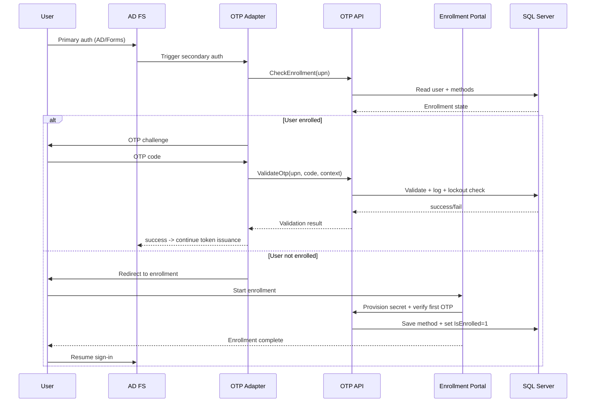
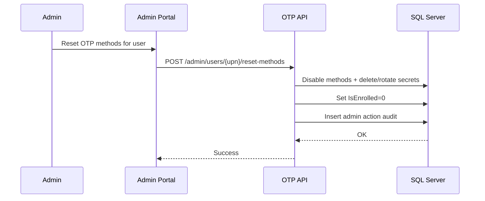

# Flux

## Sequence - Secondary OTP with enrollment fallback

```mermaid
sequenceDiagram
    participant U as User
    participant ADFS as AD FS
    participant ADP as OTP Adapter
    participant API as OTP API
    participant ENR as Enrollment Portal
    participant SQL as SQL Server

    U->>ADFS: Primary auth (AD/Forms)
    ADFS->>ADP: Trigger secondary auth
    ADP->>API: CheckEnrollment(upn)
    API->>SQL: Read user + methods
    SQL-->>API: Enrollment state

    alt User enrolled
        ADP->>U: OTP challenge
        U->>ADP: OTP code
        ADP->>API: ValidateOtp(upn, code, context)
        API->>SQL: Validate + log + lockout check
        SQL-->>API: success/fail
        API-->>ADP: Validation result
        ADP-->>ADFS: success -> continue token issuance
    else User not enrolled
        ADP->>U: Redirect to enrollment
        U->>ENR: Start enrollment
        ENR->>API: Provision secret + verify first OTP
        API->>SQL: Save method + set IsEnrolled=1
        ENR-->>U: Enrollment complete
        U->>ADFS: Resume sign-in
    end
```

## Sequence - Admin reset methods

```mermaid
sequenceDiagram
    participant ADM as Admin
    participant AP as Admin Portal
    participant API as OTP API
    participant SQL as SQL Server

    ADM->>AP: Reset OTP methods for user
    AP->>API: POST /admin/users/{upn}/reset-methods
    API->>SQL: Disable methods + delete/rotate secrets
    API->>SQL: Set IsEnrolled=0
    API->>SQL: Insert admin action audit
    SQL-->>API: OK
    API-->>AP: Success
```
